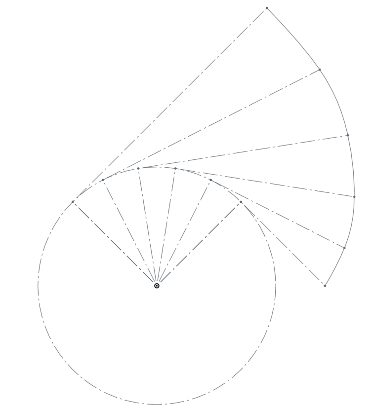

Title: 期末協同實習專案規劃 ( 20170510 Week 12 )
Date: 2017-05-10 11:00
Category: Course
Tags: w12
Slug: Week 12
Author: 2017springcd_bg1

<h3>．為何需要減速機?</h3>

為了達到<b>降低速度</b>與<b>提高扭力</b>之目的,  馬達的輸入轉經由減速機, 使輸出轉會因減速比而改變

例如馬達轉速 3000rpm 經過 1 比 3 減速機之後, 轉速會改變為 1000rpm, 但扭力卻提高近三倍

<h3>．何謂漸開線?</h3>

一條直線繞在基圓外, 將線往外拉開, 線上的一點所經過的軌跡

<h3>．如何畫漸開線正齒輪輪廓 ?</h3>

<h3>．如何模擬 2D 正齒輪組囓合 ?</h3>

<h3>．如何模擬 3D 正齒輪組囓合 ?</h3>

可以利用 Onshape 上 FeatureScript Spur Gear 的模組進行簡單的模擬

<h3>．如何將齒輪減速機構納入四足行走機構 ?</h3>

<h3>．如何以 2D 動畫模擬齒輪囓合傳動 ?</h3>

<h3>．如何以 3D 動畫模擬齒輪囓合傳動 ?</h3>

<h3>．如何模擬四足機構行走 ?</h3>

將在 Onshape 上繪製好的四足機構, 匯入 V-rep 模擬實際的運動方式

<h3>．如何列印齒輪組零件v</h3>

<h3>．如何列印連桿機構 ?</h3>

<h3>．如何組立齒輪組與行走機構 ?</h3>

<h3>．如何控制馬達 ?</h3>

